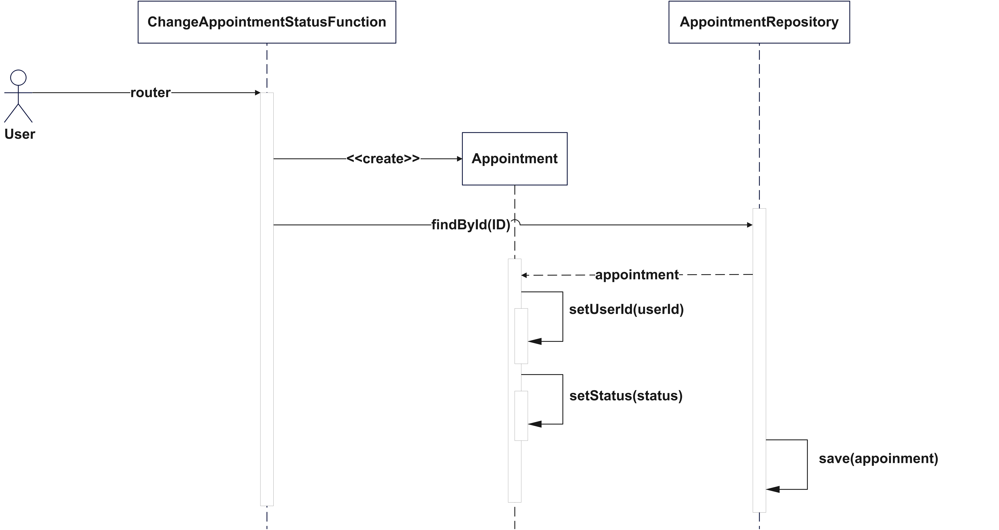

# 📅 iBook

## 📌 Real-World Problem
Many individual service providers — such as private tutors, doctors, barbers, consultants, or local repairmen — currently manage appointments manually through phone calls or messages. This manual system is:

Time-consuming, requiring back-and-forth communication
Error-prone, often leading to double bookings or forgotten appointments
Lacks visibility, as customers don't know when the provider is available
Has no history tracking, making it hard to analyze peak hours or plan availability
Causes stress and poor customer experience when scheduling conflicts arise
For example, a barber may unknowingly give the same time slot to two different customers, resulting in delays and dissatisfaction.

## 🎯 Project Motivation
This project was built to digitize the appointment scheduling process for individual service providers by offering a simple, self-managed, cloud-based system where:

Providers can publish their availability dynamically
Customers can view and book available time slots online
Booked slots are automatically marked as unavailable
Canceled slots are reopened for booking
Providers can track their daily, weekly, and monthly appointments

## 🧩 Key Problems Solved
Eliminates manual scheduling by phone or message
Prevents double bookings through real-time availability management
Saves time for both providers and customers
Brings professional-level scheduling tools to independent service providers

## 🚀 Why It Matters
By giving individuals the ability to control their own schedule, publish availability, and let customers book transparently, this system:

Increases efficiency and professionalism
Builds customer trust through reliability
Can be extended to multiple service domains easily
Enables providers to focus more on their service and less on logistics

## 📌 Context Diagram

## 📌 Use Case Diagram

## 📘 User Stories

### 🧑‍💼 As a Service Provider, I want to:
1. ✅ Create my availability timetable

   So that I can specify when I’m open for appointments
2. ✅ Dynamically add or update available time slots

   So that I can adjust my schedule anytime without external help
3. ✅ View all upcoming appointments

   So that I can prepare and avoid overlapping bookings
4. ✅ Cancel appointments or mark no-shows

   So that I can free up time and avoid lost productivity
5. ✅ Be notified of new bookings

   So that I don’t miss important appointments
6. ✅ Track appointment history

   So that I can analyze busy periods and customer frequency

### 🧑‍💻 As a Customer, I want to:
1. ✅ View a provider’s available time slots

   So that I can book without calling or waiting
2. ✅ Book an appointment online easily

   So that I can schedule services at my convenience
3. ✅ Cancel or reschedule a booking

   So that I can manage my time flexibly
4. ✅ Get confirmation and reminders

   So that I don’t forget my scheduled appointments
5. ✅ Avoid double bookings

   So that I can trust the service provider’s system

## 📌 User Story Map

## 📋 User Stories and Acceptance Criteria

## ✅ User Story 1: Book an Appointment (Customer)

**As a Customer, I want to book an appointment easily So that I can schedule services at my convenience.**

### Acceptance Criteria

- The system should allow keyword-based service search.
- The user should be able to view and select only available time slots.
- A booking should be created after user confirmation.
- A confirmation message should be sent upon booking.
- The booked slot should no longer be available to others.

## ✅ User Story 2: Create Availability Timetable (Provider)

**As a Service Provider, I want to create an availability timetable So that I can specify when I’m open for appointments.**

### Acceptance Criteria

- The provider should be able to create an initial availability timetable.
- The provider should be able to add new available time slots.
- The provider should be able to update or delete existing slots.
- Time slot changes should be reflected in real-time for customers.
- Past time slots or conflicting bookings cannot be updated.

## ✅ User Story 3: Cancel or Reschedule Booking (Customer)

**As a Customer, I want to cancel or reschedule a booking so that I can manage changes in my schedule.**

### Acceptance Criteria

- The customer should be able to view their upcoming appointments.
- Each appointment entry should include a cancel or reschedule option.
- When canceling, the system should prompt for confirmation before finalizing.
- Canceled time slots should automatically reopen for other users.
- When rescheduling, only future available time slots should be shown.
- The system should update the appointment details upon reschedule confirmation.

## User Stories Main Scenarios

## 1. Book an Appointment (Customer)
**As a Customer, I want to book an appointment easily so that I can schedule services at my convenience.**

### Main Scenario
1. Customer opens the app and searches for a service using a keyword.
2. System displays matching services with available time slots.
3. Customer selects a service and picks an available time slot.
4. System shows booking summary and asks for confirmation.
5. Customer confirms the booking.
6. System creates the appointment, marks the slot as booked, and sends confirmation.

---

## 2. Create Availability Timetable (Provider)
**As a Service Provider, I want to create an availability timetable so that I can specify when I’m open for appointments.**

### Main Scenario
1. Provider logs in and opens the availability timetable section.
2. Provider creates an initial timetable by adding time slots.
3. System saves and displays the timetable.
4. Provider adds, updates, or deletes future time slots.
5. System validates changes and updates availability in real-time for customers.

---

## 3. Cancel or Reschedule Booking (Customer)
**As a Customer, I want to cancel or reschedule a booking so that I can manage changes in my schedule.**

### Main Scenario
1. Customer logs in and views upcoming appointments.
2. System lists appointments with cancel and reschedule options.
3. Customer selects cancel, confirms cancellation; system cancels the booking and reopens the slot.
4. Alternatively, customer selects reschedule, views available future slots, selects one, and confirms.
5. System updates the appointment and sends confirmation.

## 📘 Class diagram

## 📗 Sequence diagrams

Create Appointment

Change Appointment status

